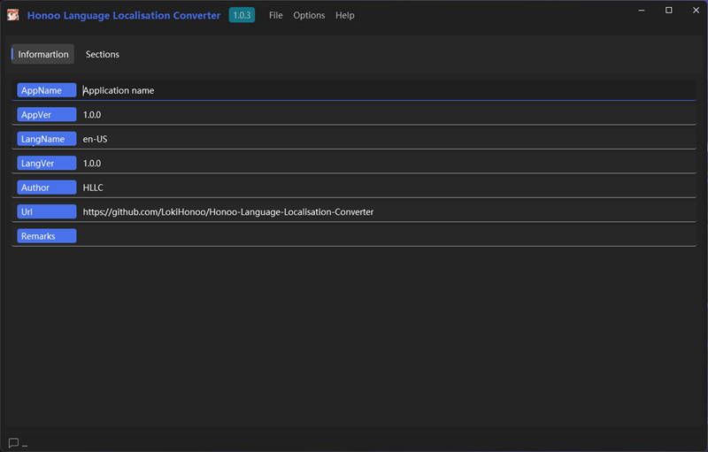
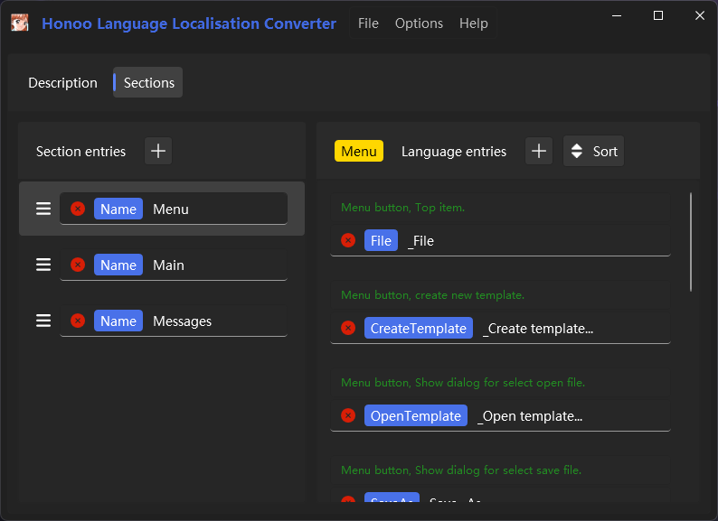

# Honoo Language Localisation Converter

- [Honoo Language Localisation Converter](#honoo-language-localisation-converter)
  - [INTRODUCTION](#introduction)
  - [SCREENSHOTS](#screenshots)
  - [EXAMPLES](#examples)
  - [CHANGELOG](#changelog)
    - [1.0.4](#104)
    - [1.0.3](#103)
  - [LICENSE](#license)

## INTRODUCTION

Language file creator. Create xml file from template. And create C# code file to load Language file.

## SCREENSHOTS





## EXAMPLES

```xaml

<MenuItem Header="{Binding Menu.File, Source={x:Static vm:LanguagePackage.Instance}}">
    <MenuItem Command="{Binding CreateNewCommand}" Header="{Binding Menu.CreateNew, Source={x:Static vm:LanguagePackage.Instance}}" />
</MenuItem>

```

## CHANGELOG

### 1.0.4

**Fix* Fix bug.

### 1.0.3

**Features* Published.

## LICENSE

[Apache-2.0](LICENSE) license.
